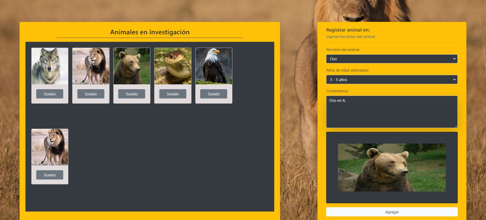

# Proyecto Registro de Animales
Este proyecto es una aplicación web que permite registrar y visualizar diferentes animales, así como reproducir sus sonidos correspondientes. Los usuarios pueden seleccionar un animal, especificar su edad y añadir comentarios. El proyecto está desarrollado con HTML, CSS y JavaScript.

# Características
Registro de animales con nombre, edad y comentarios.
Visualización de una imagen previa del animal seleccionado.
Reproducción de sonidos asociados a cada animal.
Modal para mostrar los detalles del animal registrado.

# Tecnologías Utilizadas
HTML5
CSS3
JavaScript ES6
Bootstrap (para estilos y componentes)
api interna, animales.json, para obtener informacion de los animales.

# Estructura del Proyecto
index.html: Estructura principal de la página.
styles.css: Estilos personalizados para la página.
script.js: Lógica de la aplicación.
Leon.js, Lobo.js, Oso.js, Serpiente.js, Aguila.js: Clases que representan a cada animal.
api.js: llamada a la respectiva api o cumulo de informacion.

# Dificultades
 En un principio llamar la api y crear los objetos no fue complicado, lo dificil fue unir toda la informacion despues, especialmente donde instanciar, buscamos informacion y llegamos a la conclusion de que instanciar mediante condicional era lo correcto debido a que dependiento del animal escogido se selecionaria esa instancia, decidimos usar sentencia switch para practicarla pero tambien hubiese sido valida condicionales else if.

Se coloco en la parte de comentario un maxlength con maximo 100 caracteres, asi la persona no podria exceder ese limite, sin embargo no supe hacerle un anuncio avisando que tendria ese limite.

Algo en lo personal que me cuesta es la creacion de los src en js, ya que estoy acostumbrado a simplemente escribir la ruta en el html y ya!!!, en js es un poco distinto a la hora de llamarla.

Para reproducir sonido usamos la inteligencia artifical debido a que no supe como hacerlo.

En la modal y otros lados supimos ubicar los sectores donde podriamos modificar los estilos ya que todas las imagenes se descuadraban en las card, poco a poco se va teniendo mejor lectura de los codigos. 

Algo super importante que siempre uso pero no estoy seguro de si esta bien es el uso de esta funcion para limpiar los fornularios, tengo dudas porque como tal solo se que las limpia mas no entiendo como trabaja de fondo honestamente :
// Función para limpiar los campos del formulario
const limpiarFormulario = () => {
  document.getElementById("animal").value = "";
  document.getElementById("edad").value = "";
  document.getElementById("comentarios").value = "";
  document.getElementById("preview").innerHTML = ""; // Limpiar la vista previa}
